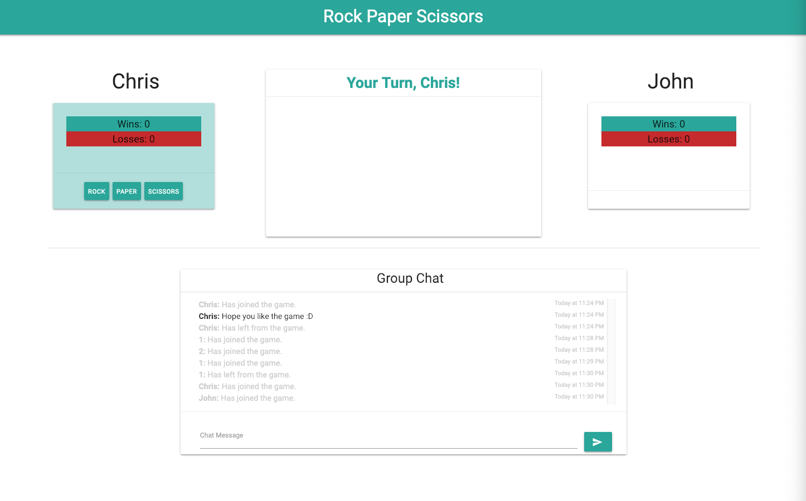

# Rock Paper Scissors - Multiplayer

[Game Page](https://nguyenchris.github.io/RPS-Multiplayer/)

## Description
Web-based browser game featuring the classic Rock, Paper, and Scissors style. The game requires at least 2 players to play where the DOM is dynamically updated based on who's turn it is to choose their choice. Firebase's Realtime Database was utilized in order to incorporate the multiplayer logic as well as in-game live chat. Go ahead and talk have a friendly competition while also inputting some "friendly" messages amongst each other.

### Technologies Used
Firebase Realtime Database, jQuery, Materialize CSS, Moment.js

NOTE: Optimized for Google Chrome Browser only.

### Preview

